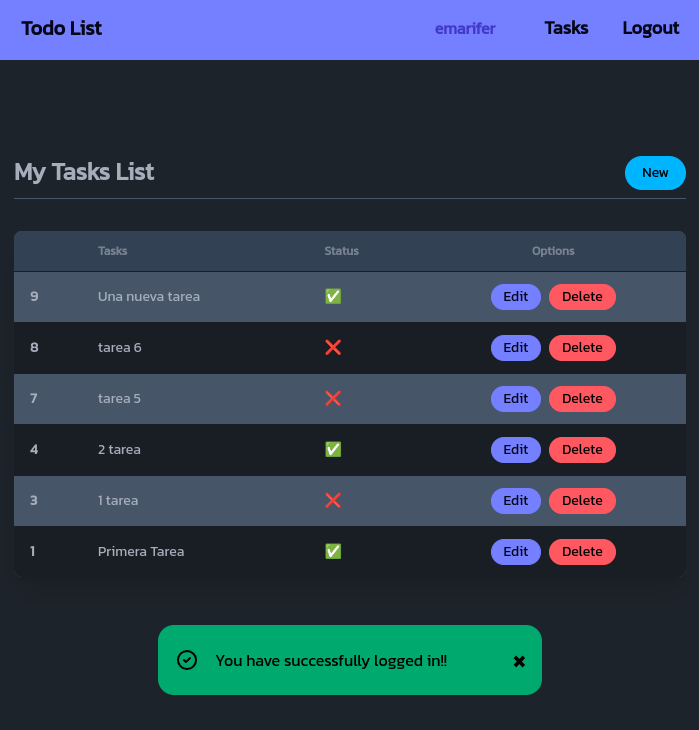

# Go/Fiber🧬 to-do list app with user login and HTMx-powered frontend (Demo)

A full-stack application using Golang's Fiber framework with session-based authentication. Once we are authenticated we can enter a view from which we can manage a list of tasks (list, update and delete). Requests to the backend are controlled by [</>htmx](https://htmx.org/) ([hypermedia](https://hypermedia.systems/) only).

### Explanation

The application allows us to perform a complete CRUD on the database, in this case SQLite3.

The DB stores both a table with the users and another table for each user's to-do. Both tables are related using a foreign key.

The use of </>html allows behavior similar to that of a SPA, without page reloads when switching from one route to another or when making requests (via AJAX) to the backend.

On the other hand, the styling of the views is achieved through Tailwind CSS and DaisyUI that are obtained from their respective CDNs.

Finally, minimal use of [_hyperscript](https://hyperscript.org/) is made to achieve the action of closing the alerts when they are displayed.

>[!NOTE]
> This application is identical to that of a previous [repository](https://github.com/emarifer/flask-htmx-todolist) of mine, which is developed in Python/Flask instead of Go/Fiber, as in this case.

---

## Screenshots:

###### Todo List Page with success alert:



<br>

###### Sign Up Page with error alert:


<br>

###### Task update page:


---

## Setup:

Besides the obvious prerequisite of having Go! on your machine, you must have Air installed for hot reloading when editing code.

Start the app in development mode:

```
$ air # Ctrl + C to stop the application
```

Build for production:

```
$ go build -ldflags="-s -w" -o ./bin/main . # ./bin/main to run the application
```

### Happy coding 😀!!